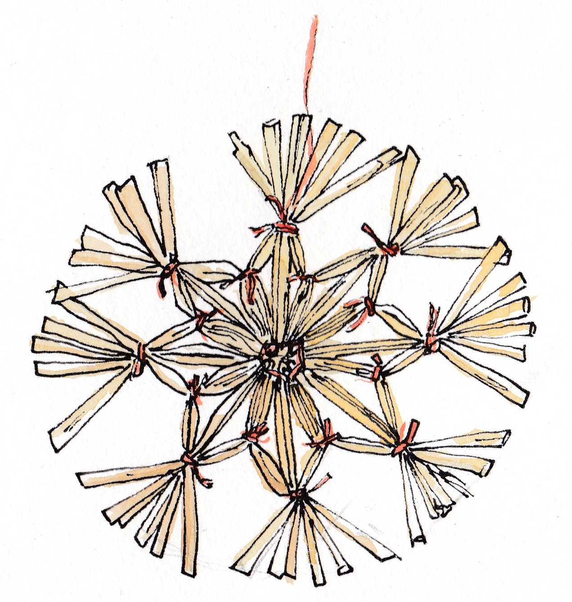

Quelques notes de décembre avec un peu de retard. Bonne année !

{: .center-image width="80%"}

---

## Coloriage de graphe pédagogique
Un 
[article sur Images des Maths](http://images.math.cnrs.fr/Jeux-sur-graphes.html?lang=fr), 
par Alain Busser, parle de l'introduction de problème de coloriage de graphes à 
des enfants de maternelle, sous forme de jeux simples. Il est assez paradoxal de
voir à quel point ces notions sont naturelles et fun, sachant qu'elles arrivent 
très tard dans le cursus scolaire (en ce qui me concerne au niveau L2/L3). 

## Le livre PIM, et la programmation efficace

Comme déjà dit [ici](./blogs), je lis le blog 
[Math $\cap$ Programming](https://jeremykun.com/)
de Jeremy Kun, et j'apprécie son approche rigoureuse théoriquement, mais appuyée 
sur la programmation. L'auteur sort un livre dans cette optique (en anglais) : 
[A Programmer's Introduction to Mathematics](https://pimbook.org/). 

Cette façon de voir l'algorithmique se rapproche un peu de 
des compétitions de programmation/algorithmique, comme 
l'[ICPC](https://icpc.baylor.edu/) organisée par l'ACM. Je n'ai jamais 
participé à une telle compétition, et l'aspect concours ne m'enchante pas, 
mais trouver un compromis entre la qualité de la 
solution et le temps pour la trouver me semble très intéressant. 
De ce point de vue, je crois que le terme 
«programmation efficace», comme dans 
[le livre de Dürr et Vie](http://tryalgo.org/book/) est bien trouvé. 

## Mouvements de Reidemeister 

La [théorie des nœuds](https://fr.wikipedia.org/wiki/Théorie_des_nœuds) 
mathématise la notion de nœud, notamment avec des mouvements élémentaires, par 
exemple faire une boucle ou croiser deux brins. 

Les 
[mouvements de Reidemeister](https://fr.wikipedia.org/wiki/Mouvements_de_Reidemeister)
sont des mouvements particuliers, qui ont la particularité de ne pas changer la 
nature du nœud. C'est très parlant sur les images de l'article wikipedia lié 
ci-dessus. Étant donné deux nœuds équivalents, on peut toujours passer de l'un 
à l'autre par ces mouvements. Le nombre de mouvements peut être borné par une 
fonction astronomique du nombre de croisements.  

(Je suis tombé sur ce concept par hasard en me baladant sur arxiv.)

## Vidéo des tasses
Une 
[très bonne vidéo](https://www.youtube.com/watch?v=9N1aYy8Q9jo&feature=youtu.be) 
de Tadashi Tokieda qui parle, comme à son habitude, d'un 
problème de la vie courante et de maths.

## Algorithme d'arbre couvrant minimum tout-en-un

Considérons l'algorithme suivant pour construire un 
[arbre couvrant de poids minimum](https://fr.wikipedia.org/wiki/Arbre_couvrant_de_poids_minimal)
(assez proche de 
l'[algorithme de Borůvka](https://fr.wikipedia.org/wiki/Algorithme_de_Bor%C5%AFvka)).

* Tous les nœuds commencent en étant ce que l'on appelle des «fragments».
* Tant qu'il y a plusieurs fragments: (1) choisir arbitrairement un fragment, 
(2) trouver une arête ayant exactement une extrémité  dans le fragment, et étant de 
poids minimum parmi celles ayant cette propriété, (3) fusionner les deux 
fragments en ajoutant cette arête.
* Renvoyer le fragment final. 

Cet algorithme généralise à la fois les algorithmes 
[de Prim](https://fr.wikipedia.org/wiki/Algorithme_de_Prim), 
[de Kruskal](https://fr.wikipedia.org/wiki/Algorithme_de_Kruskal) et 
[de Borůvka](https://fr.wikipedia.org/wiki/Algorithme_de_Bor%C5%AFvka) ! 
Pour l'algorithme de Borůvka, on choisit l'arête sortante de tous les fragments 
en même temps (avec la subtilité qu'il faut éviter les cycles). Pour 
l'algorithme de Prim, on choisit toujours le même fragment à agrandir. Enfin 
pour l'algorithme de Kruskal, on choisit le fragment qui a l'arête sortante la 
plus légère. 

On peut sans doute voir cet algorithme comme une application des règles rouge 
et bleu, mais j'aime bien ce point de vue avec un planificateur qui choisit le
fragment selon différentes stratégies.

(Je travaille de nouveau sur un problème d'arbre couvrant, ce qui m'a fait 
repenser à ce petit résultat que j'avais lu en travaillant sur 
[ce papier](https://pages.lip6.fr/Laurent.Feuilloley/publications/error_sensitive.html),
mais dont je n'ai croisé qu'une fois.)

## Espaces en latex

Deux choses basiques de latex que j'ai apprises récemment, à propos des espaces 
verticaux. 

* Au lieu de faire un `\vspace{3cm}`, on peut simplement passer à la ligne avec un 
paramètre : `\\[3 cm]`.
* On peut changer l'espace entre les items d'une liste en utilisant `itemsep`. 
Par exemple: `\setlength\itemsep{1em}` juste après un `\begin{itemize}`.

## Distance de Jaccard
Lipton et Regan parle de la 
[distance de Jaccard](https://fr.wikipedia.org/wiki/Indice_et_distance_de_Jaccard) 
(et de pourquoi c'est une métrique) dans
[un billet](https://rjlipton.wordpress.com/2018/12/14/explaining-the-jaccard-metric/)
de leur blog, *Gödel's lost letter*. Je ne connaissais pas cette distance sur 
les ensembles. Voici la définition : 

Soit $A$ et $B$ deux ensembles, leur distance est :
$$d(A,B)=1-\frac{|A \cap B|}{|A \cup B|}.$$

