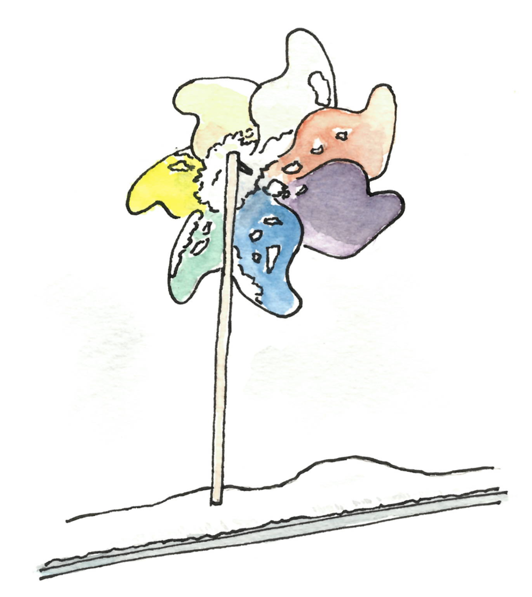

Notes de février 2019.

---

{: .center-image width="60%"}

---

## Auto-stabilisation au collège de France

Cette année je découvre le monde de 
l'[autostabilisation](https://fr.wikipedia.org/wiki/Autostabilisation). 
Un très bon exposé sur le sujet a été donné par 
[Sébastien Tixeuil](https://www-npa.lip6.fr/~tixeuil/wiki/pmwiki.php) 
au collège de France il y a quelques semaines. 
La vidéo est 
[ici](https://www.college-de-france.fr/site/rachid-guerraoui/seminar-2019-02-15-11h00.htm).

## Minorités dans les réseaux

J'ai assisté à un exposé sur les minorités dans les réseaux, par
[Claudia Wagner](http://claudiawagner.info/) dans le cadre du 
[Séminaire Complex network](http://www.complexnetworks.fr/events/) de la 
Sorbonne. 
Il y a beaucoup de choses à dire, voici quelques toutes petites choses que j'ai 
notées.

* Contrairement à ce que je pensais, la notion de 
[$k$-core](https://en.wikipedia.org/wiki/K-core) (« $k$-cœur » ?) est différente 
de la notion de $k$-clique. 
Un $k$-core d'un graphe est un sous-graphe (maximal) où tous les nœuds ont 
degré au moins $k$. 
Par exemple un graphe $k$-régulier est son propre core.
Un tel sous-graphe peut représenter une communauté homogène dans un réseau.

* Une partie de l'exposé portait sur les minorités dans wikipedia. 
Un type d'affirmation que l'on aimerait confirmer ou infirmer est le suivant : 
« les articles portant sur des femmes sont plus liés à des articles portant sur 
des femmes que sur des hommes ». 
Cet énoncé est faux en soi, mais c'est attendu puisqu'il y a plus d'articles 
portant sur des hommes. 
Qu'en est-il si l'on rajoute «proportionnement» ? Là encore ce n'est pas si 
facile, car il y a des dépendances dans le réseau. 
Une manière de faire est alors de considérer la proportion global d'articles de 
chaque genre, puis d'effacer les genres, de réétiqueter au hasard en conservant 
cette proportion, et de voir en quoi ce graphe est similaire ou différent du 
graphe de départ. Un papier sur le sujet : 
[It's a Man's Wikipedia? Assessing Gender Inequality in an Online Encyclopedia](https://arxiv.org/pdf/1501.06307.pdf)

* Une notion connue sous le nom d'efficacité de Burt, de *brokerage* ou de 
[trou structurel](https://fr.wikipedia.org/wiki/Discussion:Trou_structural) est 
(plus ou moins) la suivante. 
Un nœud appartenant à (ou étant proche de) deux clusters d'un réseau, peut avoir 
un avantage par rapport aux autres. 
En effet il a accès aux connaissances des deux communautés, et peut ou non
décider de transférer ces connaissances. 
On peut définir des coefficients qui mesurent à quel point un nœud est dans une 
telle position. 

## Conjecture 1-2-3

Un autre séminaire Complex Network (auquel je n'ai pas pu assiter) a été donné
par
[Mohammed Senhaji](http://www.labri.fr/index.php?n=Annuaires.Profile&id=Senhaji_ID1441185629) 
à propos de la conjecture 1-2-3, qui est la suivante.

Dans tout graphe, on peut numéroter chaque arête avec 1, 2, ou 3, de façon que 
chaque nœud, quand il calcule la somme des numéros sur les arêtes qui lui sont 
adjacentes, obtienne un nombre différent de celui de ses voisins.

Un survey sur cette conjecture est disponible 
[ici](https://arxiv.org/pdf/1211.5122.pdf).

## Identité de Vandermonde

L' [identité de Vandermonde](https://fr.wikipedia.org/wiki/Identit%C3%A9_de_Vandermonde)
est la suivante : 

$$
\binom{m+n}{r} = \sum_{k=0}^{r}\binom{m}{k} \binom{n}{r-k}.
$$

J'ai toujours pensé que ce n'était qu'un exercice, jusqu'à ce qu'elle 
apparaisse naturellement dans un calcul (voir 
[cet article](https://arxiv.org/pdf/1812.09120.pdf)).

