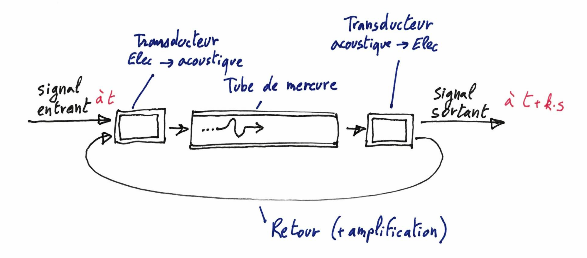
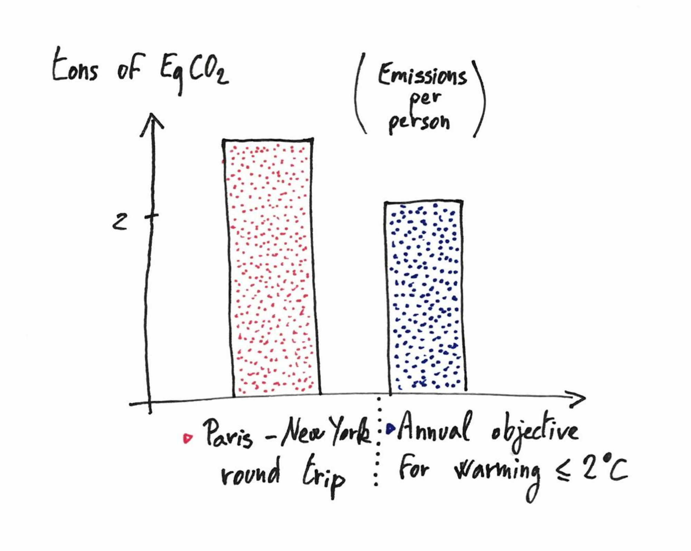
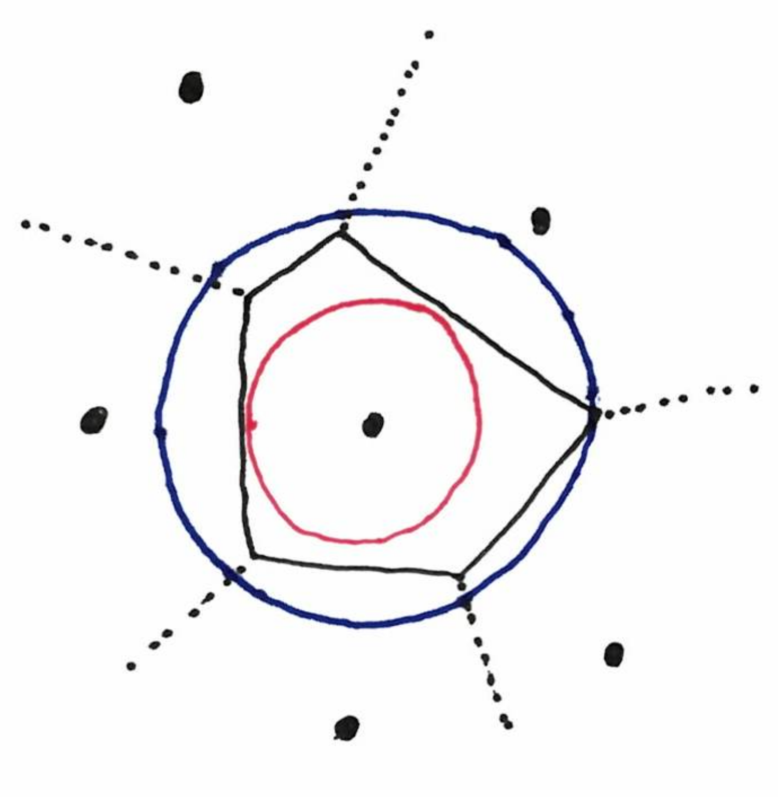

Notes de mars 2019.

---
{: .center-image width="90%"}

---

[Étant déjà en retard, je ne fais ce mois-ci 
qu'une liste annotée de pointeurs 
vers des contenus francophones. Voir la version anglophone 
[ici](https://discrete-notes.github.io/march-2019-notes-1) et 
[là](https://discrete-notes.github.io/march-2019-notes-2) pour plus de choses 
scientifiques.]

## Architecture et nouveaux langages, sur Interstices

[Interstices](https://interstices.info) est une chouette plate-forme, que 
j'oublie périodiquement, parce qu'elle n'est pas très très active.

J'ai été re-jeter un coup d'œil récemment et j'ai lu avec intérêt deux billets :

* [Pourquoi créer des nouveaux langages de programmation](https://interstices.info/pourquoi-creer-des-nouveaux-langages-de-programmation/)
* [Le modèle d'architecture de Von Neumann](https://interstices.info/le-modele-darchitecture-de-von-neumann/)

En lisant le second je suis tombé sur l'article wikipedia sur la 
[mémoire à ligne de délai](https://fr.wikipedia.org/wiki/M%C3%A9moire_%C3%A0_ligne_de_d%C3%A9lai),
l'un des premiers types de mémoire vive utilisé. 
En gros, le principe de cette mémoire était de transformer le signal électrique en 
signal acoustique, de le faire passer par un tube de mercure (ce qui prend un 
petit moment), puis de le repasser en électrique de le ré-amplifier, et de le 
refaire passer par tube etc. jusqu'à en avoir besoin. 

{: .center-image height="400px"}

L'idée vient d'une technologie utilisée dans les radars (voir l'article 
wikipedia, dont le dessin est aussi inspiré).

## Empreinte carbone de la recherche

Le collectif 1point5 a publié [une tribune](https://www.lemonde.fr/sciences/article/2019/03/19/face-a-l-urgence-climatique-les-scientifiques-doivent-reduire-leur-impact-sur-l-environnement_5438048_1650684.html) dans le Monde à propos de 
l'impact climatique de la recherche. En très raccourci il s'agit d'un appel à 
transformer la façon dont nous faisons de la recherche, pour ne pas trop 
contribuer au réchauffement climatique. En informatique, j'imagine que cet 
impact est surtout dû aux conférences. Pour preuve, l'histogramme suivant : 

{: .center-image height="500px"}

## La plus grosse cellule d'un Voronoi, sur Images des maths. 

Ce mois-ci [Images des maths nous parle](http://images.math.cnrs.fr/Une-version-de-la-conjecture-de-Kendall.html) 
d'un résultat de géométrie aléatoire du plan.
En terme simple: si on prend des points au hasard dans le plan, plus le nombre 
de points augmente, plus la plus grosse cellule se rapproche d'un disque. 
La proximité avec un disque se mesure par le rapport entre les rayons du plus 
grand cercle contenu dans la cellule et du plus petit cercle contenant la cellule. 
Voir le dessin ci-dessous.

{: .center-image height="400px"}

