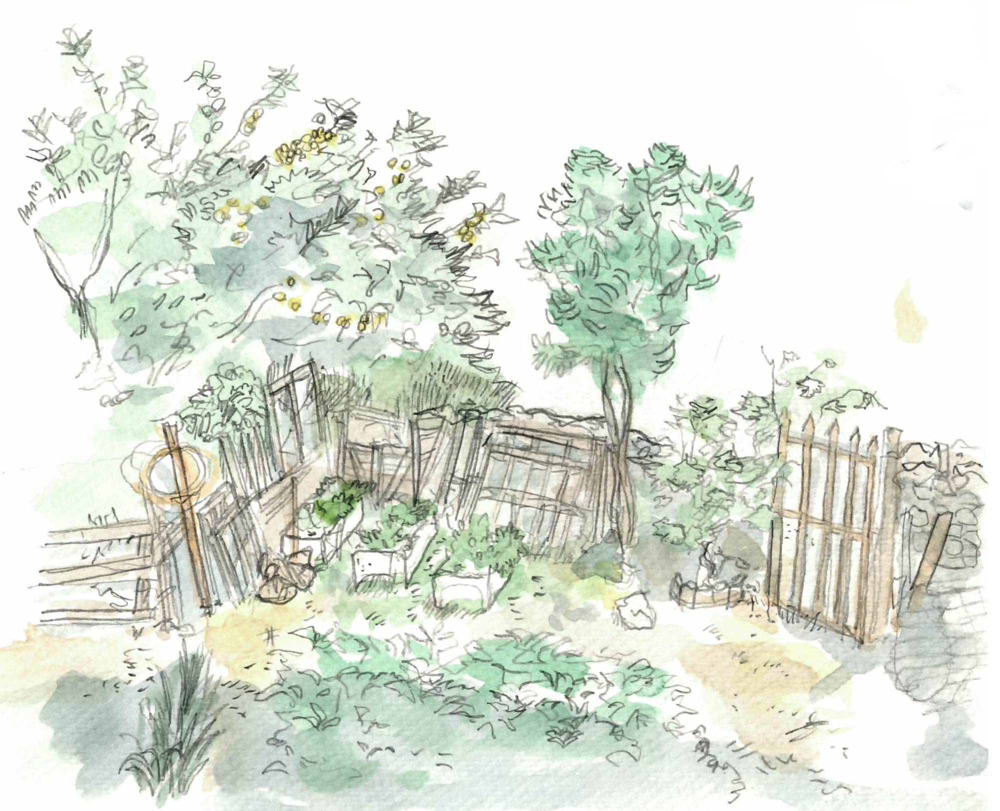
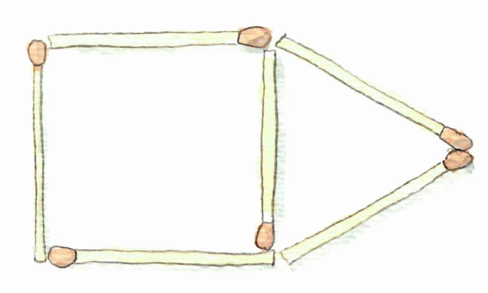
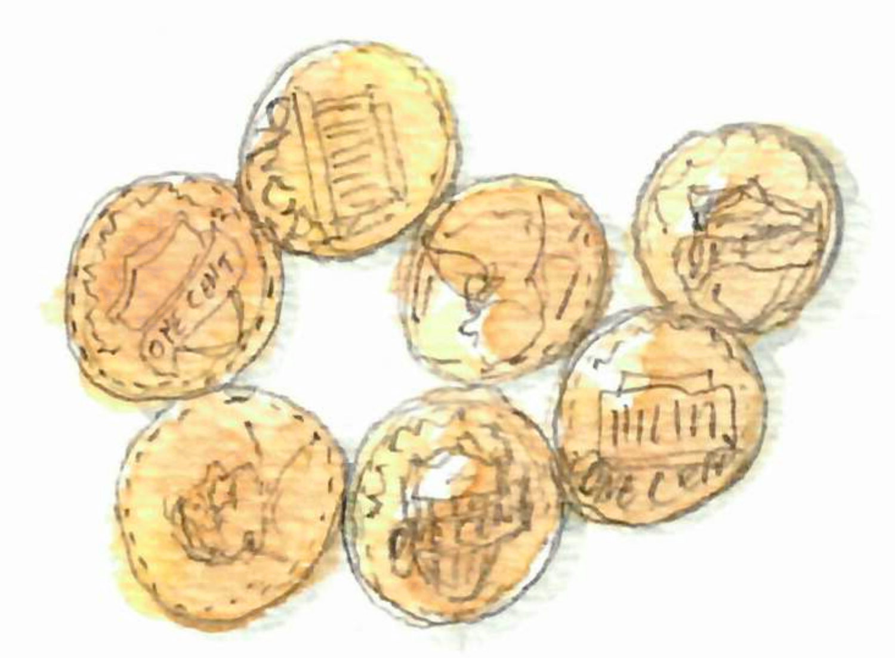
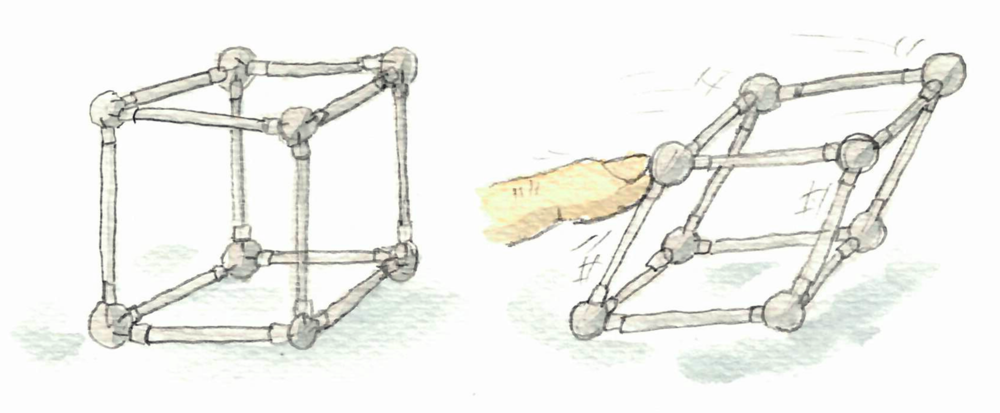
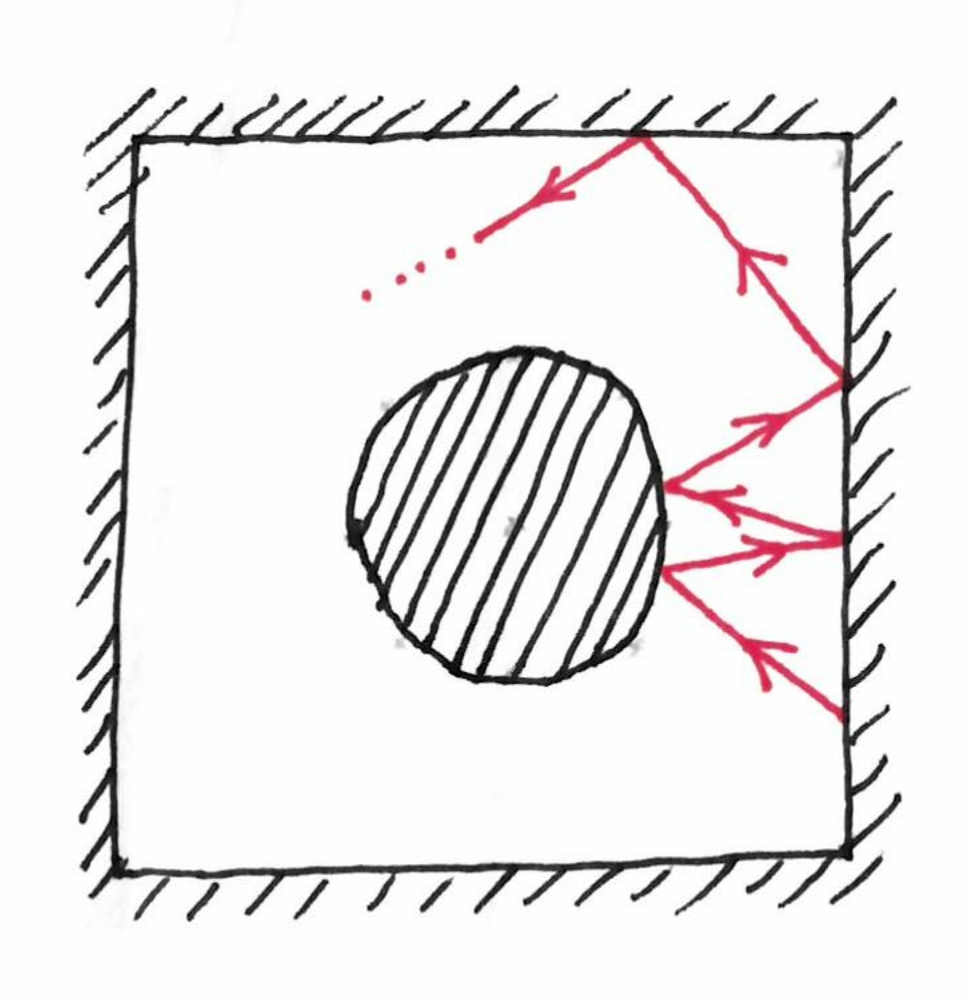

Des notes pour avril et mai. 

--- 
{: .center-image width="100%"}

---

## TIPE Océan
« Interstices » publie un 
[dossier sur l'océan](https://interstices.info/dossier/tipe-2019-2020-ocean/), 
le thème de 
[TIPE](https://fr.wikipedia.org/wiki/Travail_d%27initiative_personnelle_encadr%C3%A9) 
de l'année à venir.
Malheureusement, il n'y a pas grand chose qui utilise des maths discrètes ou de 
l'algorithmique. Il est surtout question de modélisation, et quand des objets 
discrets 
apparaissent c'est plutôt sous forme de résolution numérique d'équations 
discrétisées.
De façon générale, je serais curieux de savoir si de l'algorithmique peut 
être utile pour l'étude des océans, du climat etc.

## Des graphes définis par des allumettes, des centimes et des articulations

Voici trois classes de graphes que l'on peut décrire avec des objets du quotidien.

Les [graphes d'allumettes](https://fr.wikipedia.org/wiki/Graphe_allumette) sont 
les graphes que l'on peut dessiner sur une table avec des allumettes. 

{: .center-image height="300px"}

Plus précisement, ce sont les graphes planaires et 
[distance-unités](https://fr.wikipedia.org/wiki/Graphe_distance-unit%C3%A9), 
c'est-à-dire les graphes qui peuvent être dessinés dans le plan avec des 
arêtes (droites) de longueur 1. (« Graphe distance-unité » n'est pas un très bon 
nom mais c'est celui utilisé par wikipedia, et je n'ai pas trouvé mieux.)

Ensuite, les graphes de centimes 
([penny graphs](https://en.wikipedia.org/wiki/Penny_graph) en anglais) sont les 
graphes qui représentent des centimes sur une table.

{: .center-image height="300px"}

Plus précisément, un graphe est un graphe de centimes si il est possible de 
représenter 
chaque sommet par un disque de rayon 1, et de placer les disques de manière à ce
qu'ils ne se touchent qu'à la frontière, et que chaque contact représente une 
arête.

Les graphes de centimes sont des graphes d'allumettes, mais l'inverse n'est pas 
vrai.

Enfin, considérons l'idée suivante. Prenons un graphe, et remplaçons 
chaque arête par une tige et chaque nœud par une articulation.
Alors, si en poussant dessus, cette structure change de forme, elle est dite 
flexible, sinon elle est dites 
[rigide](https://fr.wikipedia.org/wiki/Rigidit%C3%A9_structurelle).
Par exemple un cube est flexible, mais un tétrahèdre est rigide.

{: .center-image height="300px"}

## Pagerank et billard

« Images des maths » publie 
[un billet](http://images.math.cnrs.fr/De-l-algorithme-de-Google-aux-billards-de-Sinai.html)
à propos de [PageRank](https://fr.wikipedia.org/wiki/PageRank), et des 
mathématiques des 
[billards de Sinaï](https://fr.wikipedia.org/wiki/Billard_de_Sina%C3%AF) 
(en l'honneur de 
[Viviane Baladi](https://fr.wikipedia.org/wiki/Viviane_Baladi) qui a travaillé 
sur le second sujet).

Les deux objets ont en commun de traiter d'une trajectoire dans un espace.
La base de l'algorithme PageRank consiste à visiter les pages Internet en 
suivant au hasard les liens hypertextes. 
Autrement dit, on fait une marche aléatoire sur le
graphe des liens.
Le billard de Sinaï est un billard carré, avec un obstacle rond au milieu, dans 
lequel on lance une boule, qui roule sans frottement, 
et a donc une trajectoire infinie.

{: .center-image height="300px"}

Ces deux objets ont des propriétés similaires de « mélange ». Dans le billard de 
Sinaï, si l'on lance un grand nombre de boules dans des directions légèrement 
différentes, on arrivera rapidement à une distribution relativement uniforme des 
boules sur le billard. 
Dans PageRank, le 
[théorème de Perron-Frobenius](https://fr.wikipedia.org/wiki/Th%C3%A9or%C3%A8me_de_Perron-Frobenius)
implique que rapidement, la marche aléatoire atteint une distribution 
stationnaire : la probabilité d'être en train de visiter un certain nœud 
converge.

## Timothy Gowers sur comment faire des maths

[La revue de presse](http://images.math.cnrs.fr/Revue-de-presse-avril-2019.html#readmore)
d'avril d'« Images des maths », pointent sur 
[la vidéo d'un exposé](https://smf.emath.fr/smf-dossiers-et-ressources/t-gowers-comment-decouvrir-une-demonstration-pourtant-longue-et-complexe), 
en français (!), de 
[Timothy Gowers](https://fr.wikipedia.org/wiki/Timothy_Gowers), sur le thème 
« comment découvrir une démonstration pourtant longue et complexe ».

En quelques mots il s'agit de montrer différentes techniques utilisées pour 
résoudre des problèmes : résoudre des cas particuliers, généraliser la question, 
prendre une approche probabiliste, faire des analogies, etc. 

## Non-reproductibilité et échecs non-publiés

Un [article dans Nature](https://www.nature.com/articles/d41586-019-01307-2?utm_source=twt_nnc&utm_medium=social&utm_campaign=naturenews&sf211598052=1) 
liste les « quatre cavaliers de la non-reproductibilité ».
L'un d'eux est le biais de publication: lorsque l'on recherche une corrélation, 
et que l'on n'arrive pas à la mettre en évidence, on ne peut rien publier.
Il y a deux problèmes principaux avec ce biais : (1) les chercheurs sont 
encouragés à trouver des corrélations, plutôt qu'à trouver la vérité, et (2) 
si l'on est dans un cas où il n'y a pas de corrélation dans la réalité, mais 
que statistiquement on peut détecter une (fausse) corrélation dans 5% des cas, 
alors en moyenne si 20 équipes font l'expérience, l'une d'elle détectera la 
corrélation, publiera le résultats, et les autres resteront silencieuses sur leur
absence de corrélation trouvée.

Une initiative pour réduire ce biais est la notion de 
« [registered report](https://cos.io/rr/) ». Cela consiste pour le journal, a 
évalué l'expérience elle-même (la méthode, le matériel, l'hypothèse) avant 
qu'elle soit conduite. Si ce plan est accepté, alors on fait l'expérience, 
l'article est écrit et publié (sous réserve d'être raisonnable), même si il ne 
conclue pas à une corrélation.

En informatique théorique, et en mathématiques en général, le biais de 
publication n'est pas un problème central, puisque l'on peut vérifier les 
preuves. Cependant, nous perdons sans doute beaucoup de temps à essayer des 
approches déjà testées, puisque nous ne publions pas nos échecs. 

## Avions etc.

Quelques éléments supplémentaires pour poursuivre sur une 
[note du mois dernier]([note of last month](https://discrete-notes.github.io/march-2019-notes-2)), 
à propos des trajets pour aller en conférence et de leur impact environnemental. 

Un [article de « The Conversation »](https://theconversation.com/chercheurs-donnez-lexemple-prenez-moins-lavion-110613)
mentionne plusieurs alternatives aux modèles classiques des conférences.
L'une d'elle est d'avoir des conférences purement virtuelles, comme 
[celle-ci](https://ehc.english.ucsb.edu/?page_id=12687). Dans ce format, 
personne ne bougent, tout est organisé avec des vidéos enregistrées et des 
visio-conférences.
Une autre alternative, moins drastique, est d'avoir une conférence réparties sur 
plusieurs sites (par exemple un centre par continent), avec de fait un mélange 
entre des interactions en personne et en visio-conférence. 

Au passage, rappelons qu'il existe un séminaire virtuel d'informatique 
théorique : [TCS+](https://sites.google.com/site/plustcs/).

Un autre point lié au même sujet : il est difficile de faire des efforts pour 
réduire son impact, lorsque l'on est seul et que c'est un frein pour une 
carrière. Peut-être qu'un type de charte au niveau d'une communauté ou d'une 
institution pourrait aider. 
Par exemple le journal danois « Politiken » 
[a récemment mis en place une telle charte](https://www.lemonde.fr/climat/article/2019/01/16/climat-plus-de-vols-interieurs-pour-les-journalistes-de-politiken_5409874_1652612.html?xtmc=politiken&xtcr=5) : pas de vols intérieurs 
pour les journalistes, moins de vols de manière générale, moins de pub pour des 
destinations de vacances lointaines etc.

